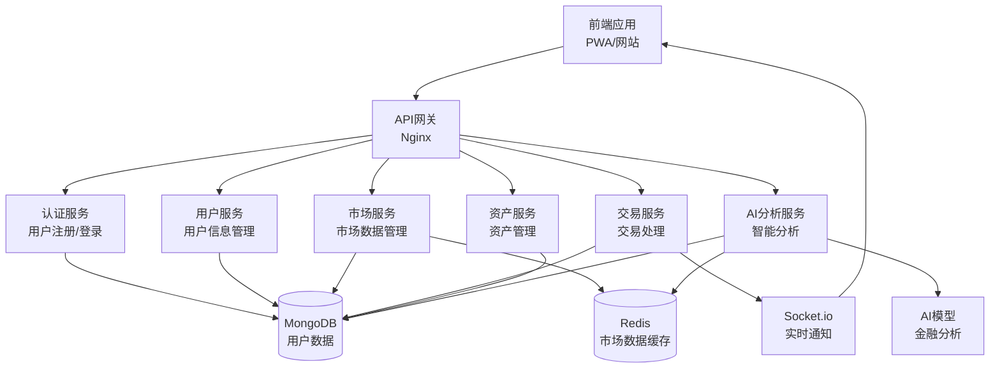
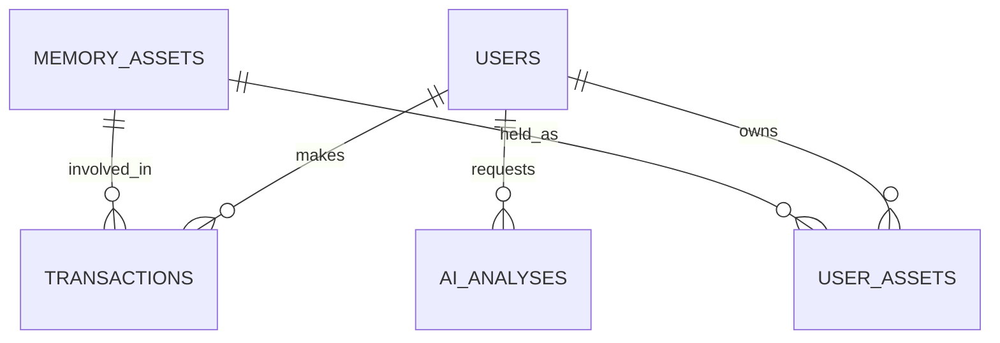
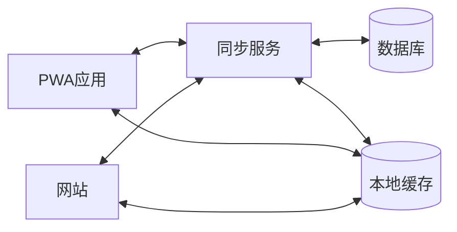

# 茶海虾王@金融交易所看板平台 - 文档汇总

## 项目概述
本项目是一个完整的金融交易所看板平台，集成了AI工具、云产品、企业支持服务等内容，提供实时数据分析、交易功能和行业洞察。

## 目录结构

### 根目录文件

#### HTML网站页面文件
- **index.html** - 主首页
- **index-en.html** - 英文首页
- **ai-tools.html** - AI工具页面
- **ai-news.html** - AI新闻页面
- **cloud-pricing.html** - 云产品定价页面
- **cloud-health.html** - 智能云健康看板页面
- **support-plans.html** - 企业支持计划页面
- **whitepapers.html** - 行业白皮书页面
- **product-updates.html** - 产品动态页面
- **pricing.html** - 定价页面
- **data-asset.html** - 数据资产页面
- **google-ads.html** - Google广告页面
- **trading-chart.html** - 交易图表页面
- **about.html** - 关于我们页面
- **login.html** - 登录页面
- **register.html** - 注册页面
- **docs.html** - 开发文档页面
- **help-center.html** - 帮助中心页面
- **help-center-en.html** - 英文帮助中心页面
- **admin-dashboard.html** - 管理员仪表盘页面
- **sandbox.html** - 沙盒测试页面
- **license.html** - 许可证页面
- **项目落实情况检查报告.html** - 项目落实情况检查报告
- **完整文件汇总.html** - 完整文件汇总
- **文档汇总.html** - 文档汇总

#### Markdown文档文件
- **API文档.md** - API接口文档
- **CHANGELOG.md** - 变更日志
- **maintenance-plan.md** - 维护计划
- **文档汇总.md** - 文档汇总
- **完整文件汇总.md** - 完整文件汇总

#### 其他根目录文件
- **docker-compose.yml** - Docker容器配置
- **manifest.json** - Web应用清单
- **service-worker.js** - 服务工作线程
- **mobile-optimization.css** - 移动端优化样式

### 后端目录 (backend/)

#### 配置文件 (backend/config/)
- **advanced-monitoring.js** - 高级监控配置
- **ai-analysis-advanced.js** - AI分析高级配置
- **ai-tools-integration.js** - AI工具集成配置
- **alert-channels.js** - 告警通道配置
- **backup.js** - 备份配置
- **cross-platform.js** - 跨平台配置
- **database.js** - 数据库配置
- **finance-data-sources.js** - 金融数据源配置
- **financeAPI.js** - 金融API配置
- **https.js** - HTTPS配置
- **logger.js** - 日志配置
- **ml-training-system.js** - 机器学习训练系统配置
- **mobile-optimization.js** - 移动端优化配置
- **payment.js** - 支付配置
- **performance.js** - 性能配置
- **realtime-push.js** - 实时推送配置
- **redis.js** - Redis配置
- **security-test.js** - 安全测试配置
- **security.js** - 安全配置
- **social-features.js** - 社交功能配置
- **technical-indicators.js** - 技术指标配置
- **tools-collection.js** - 工具集合配置

#### 部署文件 (backend/deploy/)
- **README.md** - 部署说明
- **backup.sh** - 备份脚本
- **deploy.sh** - 部署脚本
- **ecosystem.config.json** - PM2生态系统配置
- **mongod.conf** - MongoDB配置
- **nginx.conf** - Nginx配置
- **redis.conf** - Redis配置
- **setup-ssl.sh** - SSL设置脚本

#### 模型文件 (backend/models/)
- **AIAnalysis.js** - AI分析模型
- **Asset.js** - 资产模型
- **Transaction.js** - 交易模型
- **User.js** - 用户模型
- **UserAsset.js** - 用户资产模型
- **index.js** - 模型索引

#### 路由文件 (backend/routes/)
- **ai.js** - AI相关路由
- **assets.js** - 资产相关路由
- **auth.js** - 认证相关路由
- **market.js** - 市场相关路由
- **notifications.js** - 通知相关路由
- **payment.js** - 支付相关路由
- **transactions.js** - 交易相关路由
- **users.js** - 用户相关路由

#### 脚本文件 (backend/scripts/)
- **deploy-production.js** - 生产环境部署脚本
- **setup-backup-schedule.js** - 备份计划设置脚本
- **setup-production-security.js** - 生产环境安全设置脚本
- **setup-ssl.js** - SSL设置脚本

#### 后端根文件
- **.env** - 环境变量配置
- **.env.production** - 生产环境变量配置
- **README.md** - 后端说明
- **dashboard.json** - 仪表盘配置
- **deploy.bat** - Windows部署脚本
- **deploy.sh** - Linux部署脚本
- **grafana.ini** - Grafana配置
- **nginx.conf** - Nginx配置
- **package-lock.json** - NPM依赖锁定
- **package.json** - NPM包配置
- **prometheus.yml** - Prometheus配置
- **security-audit.md** - 安全审计报告
- **server.js** - 主服务器文件

### 文档目录 (docs/)

#### 系统设计 (docs/01-系统设计/)
- **server-config.md** - 服务器配置
- **系统设计文档.md** - 系统设计文档

#### 实现计划 (docs/02-实现计划/)
- **实现计划文档.md** - 实现计划文档

#### 安全合规 (docs/03-安全合规/)
- **安全修复总结.md** - 安全修复总结
- **安全合规报告.md** - 安全合规报告
- **安全审计报告.md** - 安全审计报告
- **安全版本更新日志.md** - 安全版本更新日志

#### 上线部署 (docs/04-上线部署/)
- **上线准备检查清单.md** - 上线准备检查清单
- **上线执行计划.md** - 上线执行计划
- **联网测试计划.md** - 联网测试计划

#### 维护运营 (docs/05-维护运营/)
- **维护与最佳实践文档.md** - 维护与最佳实践文档
- **网站更新计划.md** - 网站更新计划
- **网站运营测试报告.md** - 网站运营测试报告

#### 用户文档 (docs/06-用户文档/)
- **app使用注意事项与网站对接同步.md** - App使用注意事项
- **app使用说明书.md** - App使用说明书
- **用户app安装操作说明书.md** - 用户App安装操作说明
- **用户操作使用说明.md** - 用户操作使用说明

#### 客服文档 (docs/07-客服文档/)
- **客服操作使用说明.md** - 客服操作使用说明

#### 管理员文档 (docs/08-管理员文档/)
- **管理员操作使用说明.md** - 管理员操作使用说明

#### 第三方接入 (docs/09-第三方接入/)
- **CHXW-V5.3融合方案.md** - CHXW-V5.3融合方案
- **第三方兼容平台公司接入指南.md** - 第三方兼容平台接入指南
- **第三方接入操作规定和说明书.md** - 第三方接入操作规定

#### 品牌规范 (docs/10-品牌规范/)
- **品牌标准规范文档.md** - 品牌标准规范文档

### 图标目录

#### ICO图标 (ico/)
- **favicon128 .ico** - 128x128图标
- **favicon256.ico** - 256x256图标
- **favicon32.ico** - 32x32图标
- **favicon48.ico** - 48x48图标
- **favicon512.ico** - 512x512图标
- **favicon64.ico** - 64x64图标

#### 图标目录 (icons/)
- **README.md** - 图标说明

#### 网站图标目录 (网站图标/)
- **网站图标.ico** - 网站图标
- **网站图标.png** - 网站图标PNG
- **网站图标1.png** - 网站图标1
- **网站图标2.png** - 网站图标2

## 文件分类统计

### HTML文件 (23个)
- 主页面：2个（中英文）
- 功能页面：14个
- 文档页面：3个
- 报告页面：2个
- 汇总页面：2个

### Markdown文件 (16个)
- 根目录：5个
- 后端：3个
- 文档目录：8个

### 后端文件 (60个)
- 配置文件：21个
- 部署文件：7个
- 模型文件：6个
- 路由文件：8个
- 脚本文件：4个
- 根文件：14个

### 其他文件 (12个)
- 配置文件：3个
- 样式文件：1个
- 图标文件：8个

## 技术栈

### 前端
- HTML5
- Tailwind CSS
- Font Awesome
- JavaScript

### 后端
- Node.js
- Express
- MongoDB
- Redis
- PM2
- Nginx

### 监控与部署
- Prometheus
- Grafana
- Docker
- SSL/TLS

## 目录

1. [系统设计](#系统设计)
2. [实现计划](#实现计划)
3. [安全合规](#安全合规)
4. [上线部署](#上线部署)
5. [维护运营](#维护运营)
6. [用户文档](#用户文档)
7. [客服文档](#客服文档)
8. [管理员文档](#管理员文档)
9. [第三方接入](#第三方接入)
10. [品牌规范](#品牌规范)

## 系统设计

### 系统设计文档

# 茶海虾王@金融交易所看板平台
## 系统设计文档

## 一、技术栈选择

### 1.1 前端技术栈

| 技术/框架 | 版本 | 用途 | 选型理由 |
|---------|------|------|----------|
| HTML5 | 最新 | 页面结构 | 标准Web技术，支持PWA |
| CSS3 | 最新 | 样式设计 | 支持现代样式特性 |
| JavaScript | ES6+ | 客户端逻辑 | 标准脚本语言 |
| Tailwind CSS | v3 | 样式框架 | 实用优先，快速开发，响应式设计 |
| Chart.js | v4.4.8 | 数据可视化 | 轻量级，功能丰富，适合金融数据展示 |
| Font Awesome | v4.7.0 | 图标库 | 丰富的图标资源，易于集成 |
| PWA | - | 应用化 | 支持离线访问，本地安装 |

### 1.2 后端技术栈

| 技术/框架 | 版本 | 用途 | 选型理由 |
|---------|------|------|----------|
| Node.js | v18+ | 运行环境 | 高性能，适合实时应用 |
| Express.js | v4+ | Web框架 | 轻量级，灵活，适合REST API开发 |
| MongoDB | v6+ | 数据库 | 文档型数据库，适合存储复杂金融数据 |
| Redis | v7+ | 缓存 | 用于会话管理和实时数据缓存 |
| Socket.io | v4+ | 实时通信 | 支持WebSocket，实现实时数据同步 |
| JWT | - | 身份认证 | 无状态认证，适合前后端分离架构 |
| Passport.js | v0.6+ | 认证中间件 | 灵活的认证策略 |

### 1.3 部署与运维

| 技术/工具 | 版本 | 用途 | 选型理由 |
|---------|------|------|----------|
| Docker | 最新 | 容器化 | 环境一致性，易于部署 |
| Nginx | 最新 | 反向代理 | 高性能，负载均衡 |
| PM2 | 最新 | 进程管理 | 确保应用持续运行 |
| GitHub Actions | 最新 | CI/CD | 自动化部署流程 |
| AWS/Azure | - | 云服务 | 可扩展性，高可用性 |

## 二、系统架构设计

### 2.1 架构类型

**采用微服务架构**，将系统拆分为多个独立服务，每个服务负责特定功能，通过API进行通信。

### 2.2 架构组件



### 2.3 核心流程

#### 2.3.1 用户认证流程
1. 用户通过PWA应用或网站发起注册/登录请求
2. API网关将请求转发到认证服务
3. 认证服务验证用户信息，生成JWT令牌
4. 令牌返回给前端，前端存储令牌用于后续请求
5. 前端每次请求携带令牌，API网关验证令牌有效性

#### 2.3.2 数据同步流程
1. 前端操作触发数据变更（如交易）
2. 前端发送请求到对应服务
3. 服务处理请求并更新数据库
4. 服务通过Socket.io向前端推送更新通知
5. 前端接收通知并更新本地状态
6. 离线状态下，前端缓存操作，网络恢复后自动同步

#### 2.3.3 AI分析流程
1. 用户通过前端发起分析请求
2. 前端将请求发送到AI服务
3. AI服务处理请求，调用AI模型进行分析
4. 分析结果返回给前端显示
5. 分析历史存储到数据库，支持后续查询

### 2.4 技术架构优势

- **微服务架构**：各服务独立部署，便于维护和扩展
- **实时通信**：使用Socket.io实现实时数据同步
- **缓存机制**：Redis缓存热点数据，提高性能
- **PWA支持**：前端支持离线访问和本地安装
- **安全性**：JWT认证，数据加密传输

## 三、数据库设计

### 3.1 数据模型

#### 3.1.1 用户表 (users)

| 字段名 | 数据类型 | 描述 | 约束 |
|-------|---------|------|------|
| _id | ObjectId | 用户ID | 主键 |
| username | String | 用户名 | 唯一，必填 |
| email | String | 邮箱 | 唯一，必填 |
| password | String | 密码哈希 | 必填 |
| balance | Number | 钱包余额 | 默认0 |
| created_at | Date | 创建时间 | 自动生成 |
| updated_at | Date | 更新时间 | 自动生成 |
| last_login | Date | 最后登录时间 | - |

#### 3.1.2 记忆资产表 (memory_assets)

| 字段名 | 数据类型 | 描述 | 约束 |
|-------|---------|------|------|
| _id | ObjectId | 资产ID | 主键 |
| name | String | 资产名称 | 必填 |
| type | String | 资产类型 | 必填 (情感类/体验类/思想类) |
| description | String | 资产描述 | - |
| price | Number | 当前价格 | 必填 |
| market_cap | Number | 市值 | - |
| volume_24h | Number | 24小时成交量 | - |
| change_24h | Number | 24小时涨跌幅 | - |
| created_at | Date | 创建时间 | 自动生成 |
| updated_at | Date | 更新时间 | 自动生成 |

#### 3.1.3 交易表 (transactions)

| 字段名 | 数据类型 | 描述 | 约束 |
|-------|---------|------|------|
| _id | ObjectId | 交易ID | 主键 |
| user_id | ObjectId | 用户ID | 外键(users) |
| asset_id | ObjectId | 资产ID | 外键(memory_assets) |
| type | String | 交易类型 | 必填 (买入/卖出) |
| price | Number | 交易价格 | 必填 |
| quantity | Number | 交易数量 | 必填 |
| total | Number | 交易总额 | 必填 |
| fee | Number | 手续费 | - |
| status | String | 交易状态 | 必填 (待处理/完成/失败) |
| created_at | Date | 创建时间 | 自动生成 |
| updated_at | Date | 更新时间 | 自动生成 |

#### 3.1.4 用户资产表 (user_assets)

| 字段名 | 数据类型 | 描述 | 约束 |
|-------|---------|------|------|
| _id | ObjectId | 记录ID | 主键 |
| user_id | ObjectId | 用户ID | 外键(users) |
| asset_id | ObjectId | 资产ID | 外键(memory_assets) |
| quantity | Number | 持有数量 | 必填 |
| avg_price | Number | 平均成本 | - |
| created_at | Date | 创建时间 | 自动生成 |
| updated_at | Date | 更新时间 | 自动生成 |

#### 3.1.5 AI分析记录表 (ai_analyses)

| 字段名 | 数据类型 | 描述 | 约束 |
|-------|---------|------|------|
| _id | ObjectId | 分析ID | 主键 |
| user_id | ObjectId | 用户ID | 外键(users) |
| prompt | String | 分析请求 | 必填 |
| result | String | 分析结果 | 必填 |
| type | String | 分析类型 | - |
| created_at | Date | 创建时间 | 自动生成 |

### 3.2 数据库关系



### 3.3 数据索引

| 表名 | 索引字段 | 索引类型 | 用途 |
|------|---------|---------|------|
| users | username, email | 唯一索引 | 加速用户查找 |
| memory_assets | type, price | 复合索引 | 加速市场数据查询 |
| transactions | user_id, created_at | 复合索引 | 加速用户交易历史查询 |
| user_assets | user_id, asset_id | 复合索引 | 加速用户资产查询 |
| ai_analyses | user_id, created_at | 复合索引 | 加速用户分析历史查询 |

## 四、API接口设计

### 4.1 认证接口

| API路径 | 方法 | 模块 | 功能描述 | 请求体 (JSON) | 成功响应 (200 OK) |
|---------|------|------|----------|--------------|------------------|
| /api/auth/register | POST | 认证服务 | 用户注册 | `{"username": "...", "email": "...", "password": "..."}` | `{"token": "...", "user": {...}}` |
| /api/auth/login | POST | 认证服务 | 用户登录 | `{"username": "...", "password": "..."}` | `{"token": "...", "user": {...}}` |
| /api/auth/refresh | POST | 认证服务 | 刷新令牌 | `{"token": "..."}` | `{"token": "..."}` |
| /api/auth/logout | POST | 认证服务 | 用户登出 | N/A | `{"message": "Logout successful"}` |

### 4.2 用户接口

| API路径 | 方法 | 模块 | 功能描述 | 请求体 (JSON) | 成功响应 (200 OK) |
|---------|------|------|----------|--------------|------------------|
| /api/users/profile | GET | 用户服务 | 获取用户信息 | N/A | `{"user": {...}}` |
| /api/users/profile | PUT | 用户服务 | 更新用户信息 | `{"email": "...", "password": "..."}` | `{"user": {...}}` |
| /api/users/balance | GET | 用户服务 | 获取钱包余额 | N/A | `{"balance": 248.50}` |
| /api/users/balance | POST | 用户服务 | 充值/提现 | `{"amount": 100, "type": "deposit"}` | `{"balance": 348.50}` |

### 4.3 市场接口

| API路径 | 方法 | 模块 | 功能描述 | 请求体 (JSON) | 成功响应 (200 OK) |
|---------|------|------|----------|--------------|------------------|
| /api/market/assets | GET | 市场服务 | 获取资产列表 | N/A | `{"assets": [...]}` |
| /api/market/assets/:id | GET | 市场服务 | 获取资产详情 | N/A | `{"asset": {...}}` |
| /api/market/trends | GET | 市场服务 | 获取市场趋势 | N/A | `{"trends": {...}}` |
| /api/market/history/:id | GET | 市场服务 | 获取资产历史数据 | N/A | `{"history": [...]}` |

### 4.4 交易接口

| API路径 | 方法 | 模块 | 功能描述 | 请求体 (JSON) | 成功响应 (200 OK) |
|---------|------|------|----------|--------------|------------------|
| /api/transactions | POST | 交易服务 | 创建交易 | `{"asset_id": "...", "type": "buy", "quantity": 1, "price": 128.50}` | `{"transaction": {...}}` |
| /api/transactions | GET | 交易服务 | 获取交易历史 | N/A | `{"transactions": [...]}` |
| /api/transactions/:id | GET | 交易服务 | 获取交易详情 | N/A | `{"transaction": {...}}` |

### 4.5 资产接口

| API路径 | 方法 | 模块 | 功能描述 | 请求体 (JSON) | 成功响应 (200 OK) |
|---------|------|------|----------|--------------|------------------|
| /api/assets | GET | 资产服务 | 获取用户资产 | N/A | `{"assets": [...]}` |
| /api/assets/upload | POST | 资产服务 | 上传记忆资产 | `{"name": "...", "type": "...", "description": "..."}` | `{"asset": {...}}` |
| /api/assets/:id | GET | 资产服务 | 获取资产详情 | N/A | `{"asset": {...}}` |

### 4.6 AI分析接口

| API路径 | 方法 | 模块 | 功能描述 | 请求体 (JSON) | 成功响应 (200 OK) |
|---------|------|------|----------|--------------|------------------|
| /api/ai/analyze | POST | AI服务 | 分析请求 | `{"prompt": "分析当前市场趋势", "type": "market_trend"}` | `{"result": "..."}` |
| /api/ai/history | GET | AI服务 | 获取分析历史 | N/A | `{"analyses": [...]}` |
| /api/ai/suggestions | GET | AI服务 | 获取分析建议 | N/A | `{"suggestions": [...]}` |

### 4.7 WebSocket接口

| 事件名称 | 方向 | 数据结构 | 描述 |
|---------|------|----------|------|
| market:update | 服务器→客户端 | `{"asset_id": "...", "price": 128.50, "change": 2.5}` | 市场数据更新 |
| transaction:status | 服务器→客户端 | `{"transaction_id": "...", "status": "completed"}` | 交易状态更新 |
| balance:update | 服务器→客户端 | `{"balance": 248.50}` | 余额更新 |
| notification | 服务器→客户端 | `{"type": "info", "message": "..."}` | 系统通知 |

## 五、UI/UX设计

### 5.1 设计理念

- **现代金融风格**：深色背景，金色和蓝色为主色调，体现专业金融感
- **响应式设计**：适配桌面、平板和移动设备
- **直观易用**：清晰的信息层次，简化操作流程
- **实时反馈**：操作后立即显示结果，提供视觉反馈
- **个性化体验**：根据用户行为和偏好调整界面

### 5.2 页面结构

#### 5.2.1 桌面端布局

```
+-----------------------------------------------+
| 顶部导航栏 (Logo, 菜单, 用户信息)              |
+-----------------------------------------------+
|                                               |
| 市场概览区域 (资产卡片, 总市值, 成交额)        |
|                                               |
+---------------------------+-------------------+
|                           |                   |
| 市场K线图和交易面板       | AI分析模块        |
|                           |                   |
+---------------------------+-------------------+
|                                               |
| 市场新闻和个人资产区域                         |
|                                               |
+-----------------------------------------------+
| 页脚 (版权信息, 链接)                         |
+-----------------------------------------------+
```

#### 5.2.2 移动端布局

```
+-----------------------------+
| 顶部导航栏 (Logo, 菜单按钮)  |
+-----------------------------+
|                             |
| 市场概览区域 (资产卡片)      |
|                             |
+-----------------------------+
|                             |
| 市场K线图和交易面板          |
|                             |
+-----------------------------+
|                             |
| AI分析模块                   |
|                             |
+-----------------------------+
|                             |
| 市场新闻区域                 |
|                             |
+-----------------------------+
|                             |
| 个人资产区域                 |
|                             |
+-----------------------------+
| 页脚 (版权信息)             |
+-----------------------------+
```

### 5.3 核心页面设计

#### 5.3.1 首页/市场概览
- **功能**：展示市场总览、热门资产、市场趋势
- **布局**：网格布局展示资产卡片，顶部显示市场总数据
- **交互**：资产卡片悬停效果，点击进入详情页
- **响应式**：桌面端4列网格，移动端1列

#### 5.3.2 交易页面
- **功能**：资产K线图、交易表单、订单簿
- **布局**：左侧K线图，右侧交易面板
- **交互**：实时价格更新，交易确认弹窗
- **响应式**：移动端垂直布局，K线图在上，交易面板在下

#### 5.3.3 AI分析页面
- **功能**：分析请求输入、快捷分析选项、分析结果展示
- **布局**：左侧输入区，右侧结果区
- **交互**：加载动画，分析结果滚动展示
- **响应式**：移动端垂直布局，输入区在上，结果区在下

#### 5.3.4 个人资产页面
- **功能**：资产列表、余额信息、资产详情
- **布局**：顶部余额信息，下方资产列表
- **交互**：资产卡片点击进入详情，支持排序和筛选
- **响应式**：适配各种屏幕尺寸

#### 5.3.5 登录/注册页面
- **功能**：用户认证、密码找回
- **布局**：居中表单，简洁设计
- **交互**：表单验证，错误提示
- **响应式**：适配各种屏幕尺寸

### 5.4 设计规范

#### 5.4.1 颜色方案

| 颜色名称 | 色值 | 用途 |
|---------|------|------|
| 主背景色 | #0A192F | 页面背景 |
| 卡片背景 | #112240 | 卡片、面板背景 |
| 导航背景 | #172A45 | 导航栏背景 |
| 主色调 | #E6AF2E | 强调色、按钮 |
| 辅助色 | #64FFDA | 次要强调色 |
| 文本主色 | #CCD6F6 | 主要文本 |
| 文本次要色 | #8892B0 | 次要文本 |
| 成功色 | #66FF99 | 成功状态 |
| 警告色 | #FFCC66 | 警告状态 |
| 错误色 | #FF6666 | 错误状态 |

#### 5.4.2 字体方案

| 字体名称 | 用途 | 大小范围 |
|---------|------|----------|
| Orbitron | 标题、金融数据 | 16px - 32px |
| Inter | 正文、表单 | 14px - 18px |

#### 5.4.3 组件规范

- **按钮**：圆角设计，悬停效果，渐变背景
- **卡片**：轻微阴影，悬停时阴影增强
- **表单**：简洁设计，实时验证
- **图表**：深色背景，金色线条，交互提示
- **模态框**：半透明背景，居中显示

## 六、App与网站对接同步设计

### 6.1 同步架构



### 6.2 同步机制

#### 6.2.1 实时同步
- **WebSocket连接**：前端与后端建立持久连接
- **事件推送**：服务器主动推送数据更新
- **双向通信**：前端操作实时同步到后端

#### 6.2.2 离线同步
- **本地缓存**：使用localStorage或IndexedDB缓存数据
- **操作队列**：离线操作加入队列
- **网络恢复**：网络恢复后自动同步队列中的操作

#### 6.2.3 冲突处理
- **时间戳机制**：使用时间戳标记数据版本
- **乐观锁**：防止并发更新冲突
- **冲突解决策略**：用户选择或自动合并

### 6.3 数据同步策略

| 数据类型 | 同步策略 | 优先级 | 冲突处理 |
|---------|---------|--------|----------|
| 用户认证 | 实时同步 | 高 | 强制覆盖 |
| 钱包余额 | 实时同步 | 高 | 服务器为准 |
| 交易记录 | 实时同步 | 高 | 服务器为准 |
| 个人资产 | 实时同步 | 中 | 服务器为准 |
| 市场数据 | 定时同步 | 中 | 服务器为准 |
| AI分析结果 | 实时同步 | 低 | 服务器为准 |
| 用户设置 | 离线优先 | 低 | 合并策略 |

### 6.4 同步状态管理

#### 6.4.1 状态类型
- **在线**：实时同步，数据最新
- **同步中**：正在与服务器同步数据
- **离线**：使用本地缓存数据
- **同步错误**：同步失败，显示错误提示

#### 6.4.2 状态指示
- **视觉反馈**：顶部状态栏显示同步状态
- **通知机制**：同步完成或失败时通知用户
- **手动同步**：提供手动触发同步的选项

### 6.5 性能优化

- **增量同步**：只同步变更的数据
- **批量操作**：合并多个操作一次同步
- **缓存策略**：合理设置缓存过期时间
- **网络检测**：根据网络状况调整同步频率
- **后台同步**：在后台进行非紧急数据同步

## 七、安全性设计

### 7.1 前端安全

- **XSS防护**：输入验证，转义特殊字符
- **CSRF防护**：使用CSRF令牌
- **数据加密**：敏感数据本地加密存储
- **安全头部**：设置适当的安全HTTP头部
- **内容安全策略**：限制资源加载来源

### 7.2 后端安全

- **认证授权**：JWT认证，基于角色的权限控制
- **输入验证**：服务端验证所有输入
- **密码安全**：使用bcrypt加密存储密码
- **API限流**：防止暴力攻击
- **日志审计**：记录关键操作和异常

### 7.3 数据安全

- **传输加密**：使用HTTPS协议
- **数据库加密**：敏感数据加密存储
- **备份策略**：定期数据备份
- **访问控制**：严格的数据库访问权限
- **数据脱敏**：敏感信息脱敏处理

## 八、扩展性设计

### 8.1 功能扩展

- **模块化设计**：功能模块独立，便于扩展
- **插件系统**：支持第三方插件集成
- **API版本控制**：支持多个API版本共存
- **配置管理**：集中式配置管理

### 8.2 性能扩展

- **负载均衡**：多服务器负载均衡
- **水平扩展**：服务实例动态扩容
- **缓存策略**：多级缓存架构
- **异步处理**：非实时任务异步处理

### 8.3 技术扩展

- **容器化部署**：Docker容器化
- **微服务架构**：服务独立部署和扩展
- **云服务集成**：利用云服务弹性扩展
- **自动化运维**：CI/CD流程

## 九、总结

茶海虾王@金融交易所看板平台系统设计采用了现代微服务架构，结合PWA技术实现了Web应用的移动化。系统通过实时数据同步和离线功能，为用户提供了流畅、一致的跨设备体验。

核心优势包括：
- **技术先进性**：采用最新的前端和后端技术栈
- **架构灵活性**：微服务架构便于扩展和维护
- **用户体验**：响应式设计，实时数据更新，离线支持
- **安全性**：多层次安全防护机制
- **可扩展性**：模块化设计，支持功能和性能扩展

系统设计充分考虑了未来的发展需求，为平台的持续迭代和功能扩展奠定了坚实的基础。通过PWA技术和实时同步机制，实现了App与网站的无缝对接，为用户提供了统一、高效的金融分析和交易体验。

---

**茶海虾王@金融交易所看板平台**

© 2026 海南茶海虾王管理有限责任公司 保留所有权利。

技术支持服务联系：rao5201@126.com

### server-config.md

